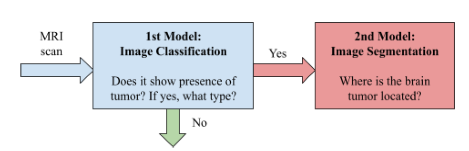
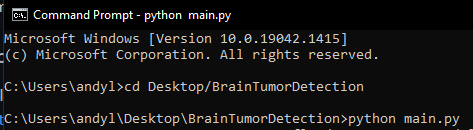
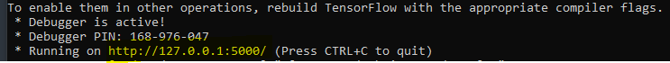
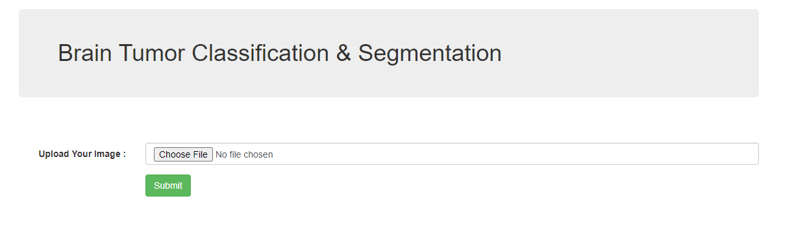

# BrainTumorDetection
Image Classification and Segmentation for Brain Tumor Detection

### Ipynb files were run on Google Colab.
Classification dataset : https://www.kaggle.com/masoudnickparvar/brain-tumor-mri-dataset
Segmentation dataset : https://www.kaggle.com/mateuszbuda/lgg-mri-segmentation

## Image Classification model with EfficientNetB3(With ImageNet weights)
The model's h5 file is stored under "model_classification.h5"

 Train Accuracy  | Test Accuracy | Micro-Average AUROC| 
| ------------- | ------------- | ------------- |
| 99.98%  | 99.39%  | 0.996

## Image Segmentation model with UNet-VGG16
The model's h5 file is stored under "model_segmentation.h5".
The results below are gathered after running 50 epochs but we did not store the model. Hence, the current json and h5 file for segmentation are retrieved after running 15 epochs only.

Test IOU  | Test DICE | 
| ------------- | ------------- | 
| 0.8918  | 0.8996  |

## How the model works?

## How to run the code?
Keep all the h5 files and main.py in a folder. CD to that folder and run main.py on command prompt. 

A link will show up as seen below. Run the link on any web browser.

You will be redirected to a homepage.

Choose any images from your desktop. There are some example images stored under 'static' folder. Click on submit and it will generate which group the brain tumor image belongs to at the top left and the location of the tumor on the right image.

## Errors & Improvements
The output above shows a true negative result. This might be due to the fact that we trained the 2 models on 2 different datasets. An improvement could be to combined the 2 datasets together and restrict the classification to no tumor and tumor only. 
